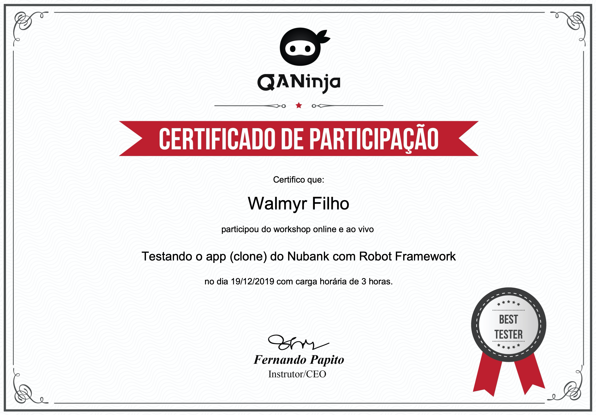

# Walmyr Filho

**E-mail:** wlsf82@gmail.com 
**Phone:** +31 06 15 18 91 75 
**Website:** https://walmyr-filho.com 
**Medium:** https://medium.com/@walmyrlimaesilv 
**Blog:** https://talkingabouttesting.com 
**Codecademy:** https://www.codecademy.com/profiles/wlsf82 
**Location:** Amsterdam, Netherlands 

I'm a software engineer that loves testing. I'm also a clean coder, blogger, YouTuber, writer, online teacher, mentor, speaker at conferences, an active member of technology communities, and a fan of good music, tattoos, and skateboarding.

## Education
Bachelor in business management with an emphasis on system information analysis at PUCRS (2012)

## Professional experience

### Senior Software Engineer in Test at [GitLab](https://gitlab.com) (March 2019 - current job)

Some of the activities I perform as a SET at GitLab are:

- Leading test automation implementation and guiding testing approaches for new feature development
- Identifying test gaps and prioritizing adding coverage based on areas of risk
- Providing input into testing the security and scalability of the product
- Leading development of new tooling and infrastructure
- Implementing new automation framework features with little guidance
- Recommending new test automation tools and processes that will improve quality and velocity
- Taking ownership of test failures and ensuring that the CI system is reliable
- Mentoring other engineers
- Independently and regularly managing project schedules ensuring objectives are aligned with team/department goals
- Working on problems of diverse scope requiring independent evaluation of identifiable factors; recommending new approaches to resolve problems
- At GitLab I work 100% remote

_Projects:_

- [GitLab Community Edition](https://gitlab.com/gitlab-org/gitlab-foss)
- [GitLab Enterprise Edition](https://gitlab.com/gitlab-org/gitlab)
- [www-gitlab-com](https://gitlab.com/gitlab-com/www-gitlab-com/)

_Stack:_ Selenium, Capybara, Rspec, Docker, Ruby, Ruby on Rails, VueJS, and GitLab.

### QA engineer at [Qelp](http://qelp.com) (July 2018 - February 2019)

I helped on defining a new software development process where quality is in mind since the definition of the software requirements until the moment it is running in production.

Some of the activities I performed as a QA engineer at Qelp were:

- Writing automated graphical user interface functional tests
- Writing automated acceptance tests
- Writing automated visual regression tests
- Defining and tunning continuous integration and continuous delivery/deployment pipelines
- Code review
- Extending the application to add testability into it
- Writing business requirements together with the business analyst
- Pair programming
- Knowledge sharing sessions
- Actively participating in software architecture meetings
- Actively participating in scrum meetings
- Debugging and fixing bugs
- Refactoring code

_Stack:_ AWS, NodeJS, JavaScript, TypeScript, React, GraphQL, Apollo, Cypress, Protractor, BackstopJS, SemaphoreCI, and Jenkins.

### Senior QA engineer at [Whereby](https://whereby.com/) (June 2016 - February 2018)

I helped the team creating end-to-end tests with the [Protractor](http://www.protractortest.org/#/) framework and visual regression tests with [BackstopJS](https://github.com/garris/BackstopJS) (for the web application), and UI tests with XCUI Test (for the iOS app). These tests were executed on CI/CD ([gocd](http://gocd.org)) for each pull request, providing fast feedback while changing the applications. I was also responsible for maintaining the CI/CD system and its infrastructure-as-code, with approximately 30 pipelines.

Every two months, I was the on-call engineer (available 24/7 in case of production incidents). In such cases, I'd have to deal with assessing the criticality of issues, accessing Linux servers for log analysis, working with monitoring tools like NewRelic, and Graphana to understand what was the issue and fixing it.

I used to work remotely very often.

_Projects:_

- [Whereby](https://whereby.com/)
- [Whereby (iOS)](https://apps.apple.com/us/app/whereby-video-meetings/id878583078)

_Stack:_ NodeJS, AngularJS, React, Protractor, Selenium Webdriver JS, BackstopJS, XCUI Test, Mocha, Tape, AWS, Terraform, Jenkins, and GoCD.

### Software developer and agile testing coach at [Taller Digital Business](http://taller.net.br/en/) (June 2014 – May 2016)

At first, I was hired as a QA engineer to create automated acceptance tests in Gherkin format with Cucumber (in Ruby language).

After some time, I helped the company in a significant transformation, where software testing was not a phase during the software development process anymore, but part of it.

During this transformation, I changed my position to a software developer.

As a software developer, I helped the team develop features, fixing bugs, writing tests, and refactoring code.

At Taller, I also had the role of an agile testing coach. As so, I used to share knowledge about agile testing throughout all the company, and help the team on building a mindset where everyone is responsible for the quality of the developed software.

At this position, I worked firstly using Scrum, and then we evolved for using Kanban and continuous flow.

I used to work remotely occasionally.

_Projects:_

- [Natura Relatório Anual](https://www.natura.com.br/relatorio-anual)
- [Natura Consumidor Final](https://www.natura.com.br/)
- [Adoro Maquiagem](https://adoromaquiagem.com.br/)
- [Drupal PECE](https://github.com/PECE-project/drupal-pece)
- [FIESC-SENAI Portal/Sistema Espaço do Estudante](https://estudante.sc.senai.br/)
- [Preço Info](https://precoinfo.com.br)
- [Blog Taller](https://blog.taller.net.br/author/walmyr/)

_Stack:_ Drupal, HTML, CSS, Javascript, jQuery, SASS, Protractor, Cucumber, Vagrant and, StriderCD.

### QA at [ADP](https://www.adp.com) (April 2011 – May 2014)

At APD, I worked in two different projects (both as a QA analyst).

In the first project, I developed automated tests in Java (using Selenium).

In the second project, I developed automated tests in VBScript (using HP Quick Test Pro).

At ADP, I had my first contact with agile methodologies, such as Scrum.

I was also the leader of an internal project called Tech Talks, used for internal knowledge sharing.

I used to work remotely occasionally.

_Stack:_ Java, VBScript, SQL, and Jenkins.

### Manual and automated test analyst at [Good Card](http://goodcard.com.br) (November 2009 - March 2011)

In this job, I had my first contact with test automation, having to make my manager understand that test automation is not about record and playback.

At Good Card, I started the creation of a test automation framework for web applications using JavaScript.

Part of my job was also creating unit tests for database triggers and procedures, creating and executing manual test cases, and managing bugs.

At this job, I also had a quick experience as a software developer, writing PL/SQL code.

_Projects:_

- [Eco Benefícios](https://www.ecobeneficios.com.br)
- [Eco Frotas](https://www.ecofrotas.com.br)

_Stack:_ Javascript, and PL/SQL

## Other projects and community contribution
### Online School: [talkingabouttesting.coursify.me](http://talkingabouttesting.coursify.me)

In March of 2018, I launched an online school to teach test automation to new QAs or even experienced professionals.

The school already has more than **1250** students and six courses.

The courses are:

- [Introduction to testing automation](https://talkingabouttesting.coursify.me/courses/introducao-aos-testes-automatizados)
- [Test architecture with Protractor](https://talkingabouttesting.coursify.me/courses/arquitetura-de-testes-com-protractor)
- [Visual regression testing with BackstopJS](https://talkingabouttesting.coursify.me/courses/testes-de-regressao-visual-com-backstopjs)
- [backtop-config mini-course](https://talkingabouttesting.coursify.me/courses/mini-curso-testes-de-regressao-visual-com-backstop-config)
- [Test automation with Cypress (basic)](https://talkingabouttesting.coursify.me/courses/testes-automatizados-com-cypress-basico)
- [Test automation with Cypress (intermediate)](https://talkingabouttesting.coursify.me/courses/testes-automatizados-com-cypress-intermediario)

### Udemy course: [Introduction to test automation](https://www.udemy.com/introduction-to-test-automation)

In this course, I teach test automation concepts at different application layers for the development of high-quality systems.

### Udemy course: [Test automation with Cypress basic](https://www.udemy.com/course/test-automation-with-cypress-basic/)

In this course, I teach how to write fast and reliable tests simply and objectively.

### Udemy course: [Test automation with Cypress intermediate](https://www.udemy.com/course/test-automation-with-cypress-intermediate/)

In this course, I teach how to optimize GUI tests using API calls.

### Book: [End to end testing with Protractor - Lessons learned about e2e test automation](https://leanpub.com/end-to-end-testing-with-protractor)

In this book, you will find a collection of practices to implement end-to-end test automation in the development process of web applications, using the Protractor framework.

NOTE: This book is also available in Portuguese through the following [link](http://casadocodigo.com.br/products/livro-protractor).

### YouTube channel: [Talking About Testing](https://www.youtube.com/user/wlsf82/videos)

YouTube channel with hands-on videos about software test automation with the Protractor framework (from the basics until more advanced things).

NOTE: The content is in Portuguese.

### Node module: [protractor-helper](http://npmjs.com/package/protractor-helper)

Library with different methods that can be used together with Protractor for creating robust end-to-end tests.

_Stack:_ Node.js

### [backstop-config](https://github.com/wlsf82/backstop-config)

A sample project with a simple implementation of BackstopJS tests that can be used by anyone who needs to run screenshot comparison tests in static web pages that have different URLs.

_Stack:_ Node.js

### Architecture proposal: [Protractor components and page objects](https://github.com/wlsf82/protractor-components-and-page-objects)

Sample project to demonstrate an architecture proposal for writing GUI tests with Protractor using a concept of components, to have stable, reliable and maintainable end-to-end tests

_Stack:_ Node.js

### [Mentoring](https://talkingabouttesting.com/mentoria-coaching/)

I mentor Jr. QAs in subjects related to test automation, agile testing, continuous integration, etc., to help them grow and be better professionals.

### [Mentors without borders](https://www.mentorswithoutborders.net/)

Mentors without borders is a group of volunteers who want to teach young people from all over the world how to enjoy the process of setting goals and taking steps towards these goals in their chosen fields. We believe that passion should be the main driver for everything that our students do because this is what will make them really efficient in pursuing their dreams.
We also help connect the students who want to pursue a career in computer programming with experienced mentors in this field.

### Code lab: [Protractor and WebRTC](http://github.com/wlsf82/protractor-and-webrtc)

Code lab to teach the basics of creating end-to-end tests with Protractor for WebRTC applications.

_Stack:_ Node.js

### Tutorial: [Visual regression testing with BackstopJS](https://github.com/wlsf82/backstopjs-example)

Tutorial on how to use BackstopJS to run visual regression tests for web applications, starting with the basics and moving forward to more advanced stuff.

_Stack:_ Node.js

### [Faker experiments](https://github.com/wlsf82/faker-experiments)

Project with Protractor tests to experiment the node module faker.js, used to generate massive amounts of fake data.

_Stack:_ Node.js, ES2015

Team members: [raulovidiu](https://github.com/raulovidiu), [@wlsf82](https://github.com/wlsf82)

### [GraphQL Explorer](https://github.com/sebas5384/graphql-explorer)

GraphQL Explorer is an application that helps you define entities related to your business domains, relate them, and then generate GraphQL schemas that can be used to connect different parts of your software, such as client and server.
I have contributed to this project refactoring its documentation and I intend to contribute more, fixing issues, developing new features and helping on making an MVP.

## Books I read

Below is a list of some books I read that helped me on being the professional I am today.

- Kanban - Successful Evolutionary Change for Your Technology Business - by David J. Anderson **(currently reading)**
- The Goal - A process of ongoing improvement - 30th anniversary edition - by Eliyahu M. Goldratt, and Jeff Cox
- How to change the world - Change management 3.0 - by Jurgen Appelo
- Getting Real - The smarter, faster, easier way to build a successful web application - from BaseCamp
- The Lean startup - How constant innovation creates radically successful businesses - by Eric Ries
- Dive Into Design Patters - by Alexander Shvets **(currently reading)**
- Continuous Delivery - Reliable software releases through build, test, and deployment automation - by Jez Humble, and David Farley
- The Phoenix Project - A novel about IT, DevOps and helping your business win - by Gene Kim, Kevin Behr, and George Spafford
- Extreme Programming - Embrace change - by Kent Beck
- Extreme Programming - Practices for day to day agile software development, by Daniel Wild, Dionatan Moura, Guilherme Lacerda, and Rafael Helm
- Building Software Teams - Ten best practices for effective software development - by Joost Vissers
- Building Maintainable Software - Ten guidelines for future-proof code - by Joost Vissers
- Clean Code - A handbook of agile software craftsmanship - by Robert C. Martin
- The Clean Coder - A code of conduct for professional programmers - by Robert C. Martin
- Clean architecture - A craftsman's guide to software structure and design - by Robert C. Martin
- The Mantra of Productivity - Improve your productivity using focus techniques and personal organisation - by Dionatan Moura
- To The Point - A receipt for creating lean products - by Paulo Caroli
- The Flip Manifesto - 16 counterintuitive ideas about motivation, innovation, and leadership - by Daniel H. Pink
- Release It - Design and deploy production-ready software - by Michael T. Nygard
- The DevOps handbook - How to create world-class agility, reliability, & security in technology organizations - by Gene Kim, Jez Humble, Patrick Debois & John Willis
- Refactoring - Improve the design of existing code (first edition) - by Martin Fowler
- Refactoring - Improve the design of existing code (second edition) - by Martin Fowler **(currently reading)**
- Agile Testing - A practical guide for testers and agile teams - by Lisa Crispin, and Janet Gregory
- Pride and Paradev - A collection of agile software testing contradictions - by Alister Scott
- Fifty Quick Ideas to Improve Your Tests - by Gojko Adzic, David Evans, and Tom Roden **(currently reading)**
- Lean Analytics - Use data to build a better startup faster - by Alistair Croll, and Benjamin Yoskovitz
- The World is Flat - The globalized world in the twenty-first century - by Thomas L. Friedman
- Hot, Flat, & Crowded - Why the world needs a green revolution - and how we can renew our global future - by Thomas L. Friedman
- Sapiens - A Brief History of Humankind - by Yuval Harari
- Blue Ocean Strategy - How to create uncontested market space and make competition irrelevant - by W. Chan Kim and Renée Mauborgne
- The Road to Learn React - by Robin Wieruch
- The Road to GraphQL - by Robin Wieruch **(currently reading)**

## Recent courses:

### Building Interactive JavaScript Websites - [Codecademy](https://www.codecademy.com/learn/build-interactive-websites)

Learn the Document Object Model, the interface between JavaScript and HTML elements, and combine HTML, CSS, and JavaScript into exciting interactive sites!

#### The applications built during the course can be found through the below links:

- https://chore-door.s3.eu-central-1.amazonaws.com/index.html
- https://piano-player.s3.eu-central-1.amazonaws.com/index.html
- https://musicon-codecademy.s3.eu-central-1.amazonaws.com/index.html

### JavaScript Errors and Debugging - [Codecademy](https://www.codecademy.com/courses/javascript-errors-debugging)

Learn how to debug and handle errors in your code!

### Introduction to TypeScript 2 - [edX](https://www.edx.org/course/introduction-to-typescript-2) (in-progress)

Learn all the basics of TypeScript to build great web applications. TypeScript is the future of web development.

### Asynchronous JavaScript - [Codecademy](https://www.codecademy.com/learn/asynchronous-javascript)

Learn how to write asynchronous JavaScript using promises and async await syntax!

### Learn Node.js - [Codecademy](https://www.codecademy.com/learn/learn-node-js)

Learn about the different components of a web application's back-end and explore the Node.js JavaScript runtime environment.

### Testing NuBank clone mobile app with Robot framework - [QA Ninja](https://www.qaninja.io)

### The Whole Team Approach to Continuous Testing - [Test Automation University](https://testautomationu.applitools.com/the-whole-team-approach-to-continuous-testing/)

This course covers:
Continuous testing, The Whole Team Approach, How to Tackle Automation without an Expert, Working Solo, Pairing Up, The Mob Approach, and The Need to Experiment.

### Web Element Locator Strategies - [Test Automation University](https://testautomationu.applitools.com/web-element-locator-strategies/)

This course covers:
What's in a Web page, programming with the DOM, finding live Web elements, CSS selectors, XPaths, advanced XPaths, picking the right locator, and using locators for testing.

### Introduction to Cypress - [Test Automation University](https://testautomationu.applitools.com/cypress-tutorial/)

This course covers:
Setting up Cypress, writing the first test, accessing elements and interacting with them, validations, grouping tests with Mocha, Cypress CLI, Page Objects in Cypress, and visual validation.

### KMP I & KMP II - [Aspercom](http://aspercom.com.br/treinamento/)

Kanban System Design & Kanban Management Professional

### Learn Vue.js - [codecademy](https://www.codecademy.com/learn/learn-vue-js)

Learn how to make front-end web apps with ease using Vue.js, an increasingly popular JavaScript front-end framework.

#### The learnings from the course can be found through the following public project on Gitlab:

- https://gitlab.com/wlsf82/learning-vuejs

### Test-Driven Rails - [Thoughtbot](https://thoughtbot.com/upcase/test-driven-rails)

Learn Test-Driven Rails Development using RSpec and Capybara in this series of tutorials. As part of the course, you can follow along with Josh as he lets his test drive through each of the steps needed to build out an application.

This course covers testing at all the levels of a Rails application and it helps on getting a new level of confidence in Rails apps - TDD is a great way to build robust and clean code.

### Selenium WebDriver with Ruby - [Test Automation University](https://testautomationu.applitools.com/selenium-webdriver-with-ruby/)

WebDriver is a powerful framework to drive actions in the web browser. This course covers:

- WebDriver basics and setting up WebDriver and Ruby
- The API and common use cases/tests using WebDriver

#### The learnings from the course can be found through the following public project on Github (fork from the course):

- https://github.com/wlsf82/webdriver-ruby-practice

### Tips on Ruby programming - [GitHub step-by-step repo with tips to better code in Ruby](https://github.com/serradura/dicas-de-programacao-em-ruby)

This "course" starts with a code that needs refactoring, and then it gives 12 tips to improve the code to use some of the Ruby best practices.

### Scaling Tests with Docker - [Test Automation University](https://testautomationu.applitools.com/scaling-tests-with-docker/)

This course covers the following subjects: introduction to Docker, Docker installation and setup, scalling tests using Selenium Grid, and scalling tests using Docker Swarm.

#### Some of the learnings from the course can be found through the following public project on Gitlab:

- https://gitlab.com/wlsf82/scaling-tests-with-docker

### Learn Ruby on Rails - [codecademy](https://www.codecademy.com/learn/learn-rails)

Learn the basics of building applications with this convenient and powerful web development framework.

#### Some of the applications built during the course can be found through the below links on GitLab:

- https://gitlab.com/wlsf82/myapp
- https://gitlab.com/wlsf82/messengerapp
- https://gitlab.com/wlsf82/travelapp

### Learn Ruby - [codecademy](https://www.codecademy.com/learn/learn-ruby)

Learn to program in Ruby, a flexible and beginner-friendly language used to create sites like Codecademy.

This course covers:
Introduction to Ruby, control flow, looping, arrays and hashes, blocks and sorting, hashes and symbols, refactoring, blocks, procs, and lambas, and finally, object-oriented programming.

Some of the code created based on the course can be found [here](https://github.com/wlsf82/ruby-exercises/tree/master/codecademy).

### The TDD Course for Beginners: Learn by Practicing 7 katas - [Udemy](https://www.udemy.com/draft/281018/)

Learn how to do test driven development using Ruby within 4 hours.

The code created based on the course can be found [here](https://github.com/wlsf82/ruby-exercises/tree/master/udemy).

### Test-Driven Development - [codecademy](https://www.codecademy.com/learn/learn-testing-for-web-development)

Why test? Fundamentals of testing, full-stack test-driven development, and the development of two full-stack web applications using outside-in TDD.

### Introduction to JavaScript - [codecademy](https://www.codecademy.com/learn/introduction-to-javascript)

Introduction to JavaScript variables, control flow, functions and higher-order functions, scope, arrays, loops, iterators, objects, advanced objects,  classes, browser compatibility and transpilation, intermediate JavaScript modules, promises, async-await, and finally, requests (with ES5, ES6 and ES7 syntax).

### Advanced WebRTC Architecture course - [BlogGeek.me](https://webrtccourse.com/course/webrtc-architecture/)

