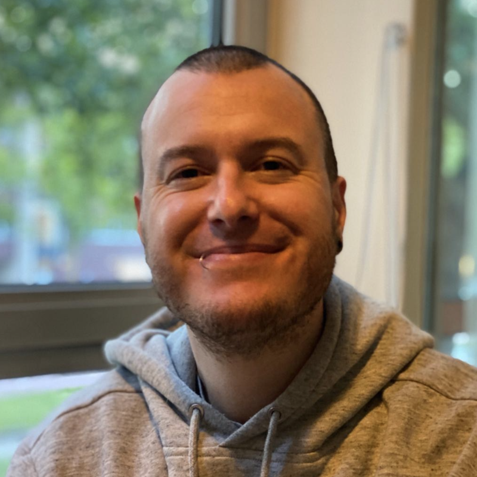

# Walmyr Lima e Silva Filho

## Senior QA Engineer · SDET · Software Engineer in Test · QA Developer

### Thought leader in QA · online instructor · YouTuber · Cypress.io Ambassador · Blogger · Podcaster · Mentor

**E-mail:** wlsf82@gmail.com  
**Phone:** +34 669257533  
**Location:** Barcelona, Spain

**Website:** https://walmyr.dev  
**Online School:** https://talkingabouttesting.school  
**Dev Community:** https://dev.to/walmyrlimaesilv  
**Medium:** https://medium.com/@walmyrlimaesilv  
**Blog:** https://talkingabouttesting.com  
**Codecademy:** https://www.codecademy.com/profiles/wlsf82

I'm a software engineer who loves testing. I'm also a clean coder, entrepreneur, blogger, YouTuber, Cypress.io Ambassador, online instructor, mentor, speaker, and an active member of the testing automation and JavaScript communities.

## Education
Bachelor's in business management with an emphasis on system information analysis at PUCRS (2012)

## Technologies and programming languages

* **Programming Languages:** JavaScript, TypeScript, Ruby
* **Testing:** Cypress, Playwright, Selenium, Puppeteer, Webdriver IO, Jest, Mocha, Chai, Supertest, Postman, Applitools, Percy, BackstopJS, XCUI Test, Detox
* **CI/CD and infrastructure:** git, GitHub, GitLab, Jenkins, CircleCI, Docker, AWS, GCP, Vercel, Linux, Unix
* **Web development:** Nodejs, React, VueJS, Express, GraphQL, MongoDB, HTML5, CSS3, ESLint
* **AI-assisted development:** Claude Code, Antigravity, GitHub Copilot, Cursor, ChatGPT
* **Programming paradigms:** Object-oriented programming, functional programming
* **Other:** Jira, Trello, Slack, Zoom, MS Teams

## Professional experience

### Senior QA Engineer at [Leadtech](https://leadtech.com) (2025 - current job)

At Leadtech, I work on a web app project as a Senior QA Engineer.

For this project, I:

- Defined and implemented the project's quality strategy, from requirements to production
- Built the automated test suite from scratch with Cypress and Playwright
- Set up continuous integration workflows so every pull request gets automated feedback before merge
- Run exploratory testing sessions and participate in Scrum ceremonies

### Online instructor and founder at [Talking About Testing School](https://talkingabouttesting.school/) (2018 - current job)

In 2018, I started an online school called Talking About Testing.

The school focuses on teaching test automation and offers more than 10 courses.

Summing up the number of students on all platforms ([TAT School - my own platform](https://talkingabouttesting.school/), [Coursify.me](https://talkingabouttesting.coursify.me/), [Hotmart](https://hotmart.com/pt-br/club/cypress-playground-ate-a-nuvem), and [Udemy](https://www.udemy.com/user/walmyr/)), I already have more than 27K students.

### Senior Quality Assistance Software Engineer at [Typeform](https://typeform.com/) (March 2022 - January 2023)

At Typeform I:

- Cut visual regression testing costs by replacing an expensive SaaS with a self-hosted open-source alternative
- Ran Cypress Masterclasses that enabled product teams to write and maintain their own automated tests
- Refactored existing test code and reviewed pull requests to raise the quality bar across teams
- Ran exploratory testing sessions to uncover issues automated checks were missing

### Senior QA engineer at [QWIC](https://qwic.de/)  (September 2020 - January 2021)

At QWIC I:

- Migrated the end-to-end suite from Puppeteer + Jest to Cypress, and restructured the framework for readability and easy maintenance
- Increased test coverage by adding end-to-end and component tests, and enabled testing the frontend independently of the backend
- Automated dependency and security updates with GitHub Dependabot
- Improved the git workflow and introduced Kanban, making delivery steadier and more predictable
- Maintained the CI/CD pipelines, reviewed code, triaged service desk issues, and developed small features in React

### Software Consultant at [Taller Digital Business](https://taller.net.br) (July 2020 - September 2020)

- Consulting in quality assurance subjects
- Workshops and training in testing automation topics
- 100% remote

### Senior Software Engineer in Test at [GitLab](https://gitlab.com) (March 2019 - June 2020)

As a SET at GitLab I:

- Led test automation for new feature development, identifying test gaps and prioritizing coverage by area of risk
- Built new tooling and framework features for the end-to-end automation suite, working autonomously on problems of diverse scope
- Took ownership of test failures to keep the CI system reliable and trusted by developers
- Introduced test automation tools and processes that improved quality and delivery velocity
- Advised on testing the security and scalability of the product
- Mentored other engineers and managed project schedules independently, aligned with department goals
- Worked 100% remotely

### QA engineer at Qelp (July 2018 - February 2019)

I helped define a new software development process that prioritizes quality from the initial definition of software requirements through to its deployment in production.

Some of the activities I performed as a QA engineer at Qelp were:

- Writing automated graphical user interface functional tests
- Writing automated acceptance tests
- Writing automated visual regression tests
- Defining and tuning continuous integration and continuous delivery/deployment pipelines
- Code reviews
- Extending the application to add testability to it
- Writing business requirements together with the business analyst
- Pair programming
- Knowledge-sharing sessions
- Actively participating in software architecture meetings
- Actively participating in Scrum meetings
- Debugging and fixing bugs
- Refactoring code

### Senior QA engineer at [Whereby](https://whereby.com/) (June 2016 - February 2018)

I helped the team create end-to-end tests using the [Protractor](https://www.protractortest.org/#/) framework and visual regression tests with [BackstopJS](https://github.com/garris/BackstopJS) (for the web application), as well as UI tests with XCUI Test (for the iOS app). These tests were executed on CI/CD ([gocd](https://gocd.org)) for each pull request, providing fast feedback while changing the applications. I was also responsible for maintaining the CI/CD system and its infrastructure-as-code, with approximately 30 pipelines.

Every two months, I was the on-call engineer (available 24/7 in case of production incidents). In such cases, I'd have to assess the criticality of issues, access Linux servers for log analysis, and work with monitoring tools like New Relic and Grafana to understand the issue and resolve it.

I used to work remotely very often.

### Software developer and agile testing coach at [Taller Digital Business](https://taller.net.br/) (June 2014 – May 2016)

Hired as a QA engineer to write automated acceptance tests in Gherkin with Cucumber (Ruby), then grew into a software developer role while coaching the company through a transformation where testing stopped being a phase and became part of development. Also drove the team's move from Scrum to Kanban and continuous flow.

### QA analyst at [ADP](https://www.adp.com) (April 2011 – May 2014)

Built automated tests for two products, in Java with Selenium and in VBScript with HP Quick Test Pro. Led Tech Talks, an internal knowledge-sharing program, and had my first exposure to agile methodologies.

### Manual and automated test analyst at Good Card (November 2009 - March 2011)

Started the company's first test automation framework for web applications in JavaScript, after convincing management that automation is more than record and playback. Also wrote unit tests for database triggers and procedures, executed manual test cases, managed bugs, and wrote PL/SQL code.

### Other jobs as a tester/QA

Before moving into test automation (between 2004 and 2009), I worked as a manual tester at Hewlett-Packard, Sicredi, Softplan, Dell Computers, and Datum TI.

## Languages

- **English:** Bilingual or Proficient (C2)
- **Spanish:** Intermediate (B1)
- **Portuguese:** Bilingual or Proficient (C2)

## Side projects and community contribution

Here's a [list of side projects](./partials/SIDE_PROJECTS.md) I work on.

## Books I read

Here's a [list of some books I read](./partials/BOOKS.md) that helped me become the professional I am today.

## Courses I took

Here's a [list of courses I took](./partials/COURSES.md).
