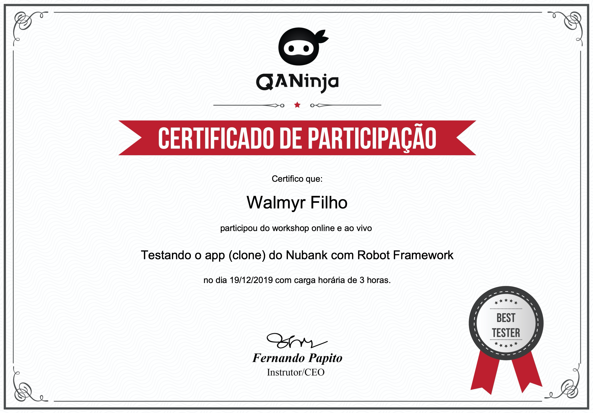

# Courses I took

## [ChatGPT Prompt Engineering for Developers](https://www.deeplearning.ai/short-courses/chatgpt-prompt-engineering-for-developers/)

This course covers:

- Introduction
- Guidelines
- Iterative
- Summarizing
- Inferring
- Transforming
- Expanding
- Chatbot
- Conclusion

## [Advanced Cypress](https://testautomationu.applitools.com/advanced-cypress-tutorial/) - by Filip Hric

This course covers:

- Setup
- Chaining commands
- Multiple assertions
- Changing the DOM
- Cookies
- Sending requests
- Intercepting newtwork requests
- Stubbing responses
- Creating a custom command
- Installing plugins
- Running a task

## [Epic React](https://epicreact.dev) - by Kent C. Dodds (**in-progress**)

This course covers:

- React Fundamentals
- React Hooks
- Advanced React Hooks
- Advanced React Patterns
- React Performance
- Testing React Apps
- React Suspense
- Build an Epic React App
- Bonus Interviews with React Community Experts

I've started documenting the learnings of each module, and I'll list them below, as I finish each one.

- http://github.com/wlsf82/epic-react-fundamentals

## Functional Programming and SOLID - by Robert C. Martin on [Clean Coders](https://cleancoders.com/episode/clean-code-episode-58)

This video talks about how SOLID principles can adhere to the functional paradigm.

The five solid principles are:

- SRP - The Single Responsibility Principle,
- OCP - The Open-Closed Principle,
- LSP - The Liskov Substitution Principle,
- ISP - The Interface Segregation Principle, and
- DIP - The Dependency Inversion Principle.

## [THE BADASS WORKSHOP](https://www.thebadassworkshop.com) - by Bozama Saint John

This workshop covers:

- Session 1: Learn to identify your unique talents and show up as your full self
- Session 2: Find your voice to create the career you want... and be LOUD about it
- Session 3: How to ask, get, make, and do the most
- Session 4: Condition your inner BUSINESS athlete to play the long game
- Session 5: Manifest the lessons in sessions 1-4 into your future self RIGHT NOW

## Contract Tests with Pact - [Test Automation University](https://testautomationu.applitools.com/pact-contract-tests/)

This course covers:

- Introduction to Contract Tests
- Setting up Pact
- Creating your first test
- Publishing and Matching
- Best Practices for Contract Testing
- Authentication and Authorization
- Common Issues and Analyzing Test Results
- CI/CD Pipeline

**Note:** The code created during this course can be found through the following URL https://github.com/wlsf82/tau-pact-nodejs-course.

## Functional Programming - [Eric Elliott JS](https://ericelliottjs.com/premium-content) (**in-progress**)

This course covers:

- Abstraction and Composition
- ES6 Curry and Function Composition
- How to Redux
- What is a Clousure?
- Pure Functions

## Introduction to Node and Express - [Eric Elliott JS](https://ericelliottjs.com/premium-content)

This course covers:

- A basic introcution to Node and Express
- How to install Node using NVM (Node version manager)
- Express installation and usage (creating a simple node server)
- Working with environment variables
- Testing of Express routes with Supertest and Tape
- Refactoring Express routes with middleware to avoiding code duplication

> The code created during this course can be found in the following repo https://github.com/wlsf82/node-and-express/.

## TDD Day - [Eric Elliott JS](https://ericelliottjs.com/premium-content)

This course covers:

- What is TDD?
- Why TDD?
- Why Test First? Q&A
- Kinds of Tests
- 5 Questions and RITE Way
- Project - Unit Tests
- What are Functional Tests
- Project - Functional Testing
- Mocking is a Code Smell
- Mocking is a Code Smell Q&A
- Project - Reducer Tests

## Exploring Service APIs through Test Automation - [Test Automation University](https://testautomationu.applitools.com/exploring-service-apis-through-test-automation/)

This course covers:

- What exactly is a service API, and why is it so important to make sure that they have their own thorough test cycle
- Tools for API discovery and exploration
- Deep dive into the Postman tools
- The P.O.I.S.E.D. testing heuristic to improve and expand the testing strategy
- How to use Postman to run automated tests, do data-driven testing and include tests in a continuous integration environment

## Building Interactive JavaScript Websites - [Codecademy](https://www.codecademy.com/learn/build-interactive-websites)

Learn the Document Object Model, the interface between JavaScript and HTML elements, and combine HTML, CSS, and JavaScript into exciting interactive sites!

### The applications built during the course can be found through the below links:

- https://chore-door.s3.eu-central-1.amazonaws.com/index.html
- https://piano-player.s3.eu-central-1.amazonaws.com/index.html
- https://musicon-codecademy.s3.eu-central-1.amazonaws.com/index.html

## JavaScript Errors and Debugging - [Codecademy](https://www.codecademy.com/courses/javascript-errors-debugging)

Learn how to debug and handle errors in your code!

## Introduction to TypeScript 2 - [edX](https://www.edx.org/course/introduction-to-typescript-2)

Learn all the basics of TypeScript to build great web applications. TypeScript is the future of web development.

## Asynchronous JavaScript - [Codecademy](https://www.codecademy.com/learn/asynchronous-javascript)

Learn how to write asynchronous JavaScript using promises and async await syntax!

## Learn Node.js - [Codecademy](https://www.codecademy.com/learn/learn-node-js)

Learn about the different components of a web application's back-end and explore the Node.js JavaScript runtime environment.

## Testing NuBank clone mobile app with Robot framework - [QA Ninja](https://www.qaninja.io)

Learn how to create automated tests for mobile apps using the Robot framework.

  
Click to see the certificate

  

## The Whole Team Approach to Continuous Testing - [Test Automation University](https://testautomationu.applitools.com/the-whole-team-approach-to-continuous-testing/)

This course covers:
Continuous testing, The Whole Team Approach, How to Tackle Automation without an Expert, Working Solo, Pairing Up, The Mob Approach, and The Need to Experiment.

## Web Element Locator Strategies - [Test Automation University](https://testautomationu.applitools.com/web-element-locator-strategies/)

This course covers:
What's in a Web page, programming with the DOM, finding live Web elements, CSS selectors, XPaths, advanced XPaths, picking the right locator, and using locators for testing.

## Introduction to Cypress - [Test Automation University](https://testautomationu.applitools.com/cypress-tutorial/)

This course covers:
Setting up Cypress, writing the first test, accessing elements and interacting with them, validations, grouping tests with Mocha, Cypress CLI, Page Objects in Cypress, and visual validation.

## KMP I & KMP II - [Aspercom](https://aspercom.com.br/treinamentos/)

Kanban System Design & Kanban Management Professional

  
Click to see the certificates

  

  

## Learn Vue.js - [codecademy](https://www.codecademy.com/learn/learn-vue-js)

Learn how to make front-end web apps with ease using Vue.js, an increasingly popular JavaScript front-end framework.

### The learnings from the course can be found through the following public project on Gitlab:

- https://gitlab.com/wlsf82/learning-vuejs

## Test-Driven Rails - [Thoughtbot](https://thoughtbot.com/upcase/test-driven-rails)

Learn Test-Driven Rails Development using RSpec and Capybara in this series of tutorials. As part of the course, you can follow along with Josh as he lets his test drive through each of the steps needed to build out an application.

This course covers testing at all the levels of a Rails application and it helps on getting a new level of confidence in Rails apps - TDD is a great way to build robust and clean code.

## Selenium WebDriver with Ruby - [Test Automation University](https://testautomationu.applitools.com/selenium-webdriver-with-ruby/)

WebDriver is a powerful framework to drive actions in the web browser. This course covers:

- WebDriver basics and setting up WebDriver and Ruby
- The API and common use cases/tests using WebDriver

### The learnings from the course can be found through the following public project on Github (fork from the course):

- https://github.com/wlsf82/webdriver-ruby-practice

## Scaling Tests with Docker - [Test Automation University](https://testautomationu.applitools.com/scaling-tests-with-docker/)

This course covers the following subjects: introduction to Docker, Docker installation and setup, scalling tests using Selenium Grid, and scalling tests using Docker Swarm.

### Some of the learnings from the course can be found through the following public project on Gitlab:

- https://gitlab.com/wlsf82/scaling-tests-with-docker

## Learn Ruby on Rails - [codecademy](https://www.codecademy.com/learn/learn-rails)

Learn the basics of building applications with this convenient and powerful web development framework.

### Some of the applications built during the course can be found through the following public project on Gitlab:

- https://gitlab.com/wlsf82/myapp
- https://gitlab.com/wlsf82/messengerapp
- https://gitlab.com/wlsf82/travelapp

## Learn Ruby - [codecademy](https://www.codecademy.com/learn/learn-ruby)

Learn to program in Ruby, a flexible and beginner-friendly language used to create sites like Codecademy.

This course covers:
Introduction to Ruby, control flow, looping, arrays and hashes, blocks and sorting, hashes and symbols, refactoring, blocks, procs, and lambas, and finally, object-oriented programming.

Some of the code created based on the course can be found [here](https://github.com/wlsf82/ruby-exercises/tree/master/codecademy).

## The TDD Course for Beginners: Learn by Practicing 7 katas - [Udemy](https://www.udemy.com/draft/281018/)

Learn how to do test driven development using Ruby within 4 hours.

The code created based on the course can be found [here](https://github.com/wlsf82/ruby-exercises/tree/master/udemy).

## Test-Driven Development - [codecademy](https://www.codecademy.com/learn/learn-testing-for-web-development)

Why test? Fundamentals of testing, full-stack test-driven development, and the development of two full-stack web applications using outside-in TDD.

  
Click to see the certificate

  

## Introduction to JavaScript - [codecademy](https://www.codecademy.com/learn/introduction-to-javascript)

Introduction to JavaScript variables, control flow, functions and higher-order functions, scope, arrays, loops, iterators, objects, advanced objects,  classes, browser compatibility and transpilation, intermediate JavaScript modules, promises, async-await, and finally, requests (with ES5, ES6 and ES7 syntax).

## Advanced WebRTC Architecture course - [BlogGeek.me](https://webrtccourse.com/course/webrtc-architecture/)

  
Click to see the certificate

  

[Back to homepage](../README.md)
